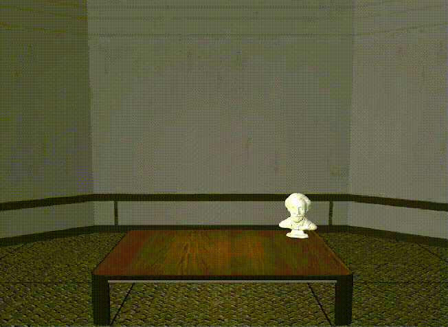
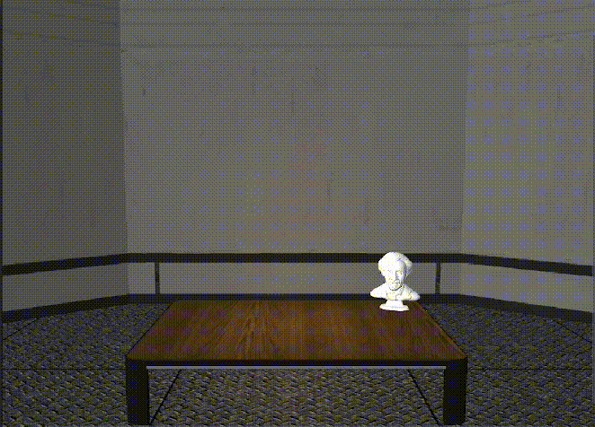

# Unity Physics Particles
This is a Unity project that was created as an assignment for a Master's in Artificial Intelligence course. It demonstrates various physics laws on particles using C# scripts. The project contains 4 different particle behaviors.

## Behaviors
1. Particles are generated from an origin and fall in different directions in space. The particles are enclosed in a transparent box and bounce off the walls whenever they collide with it. A drag force is applied to demonstrate air resistance. 

2. Same as Behavior 1, but with the addition of two magnets outside the transparent box. The power of the magnets can be adjusted, and the particles will concentrate closer to the stronger magnet. 

3. A predefined number of particles start at a point in space and all apply a repulsion force to each other. In this case, no gravitational force is applied and the particles are surrounded by a transparent sphere. 

4. A bird-flying behavior is demonstrated. The particles move inside a transparent box like fish in the water. 

## Scripts
The project contains two scripts for each behavior:

1. Task#Manager: In charge of initializing the particles and additional objects needed for each task.
2. Task#Behavior: Performs the movement of each particle according to the applied physics laws.